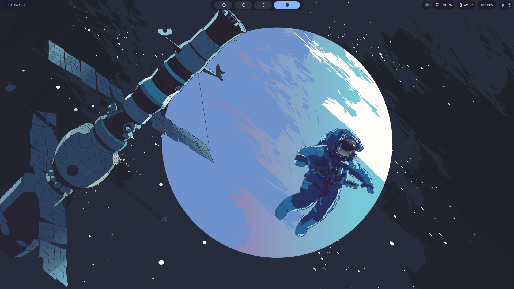
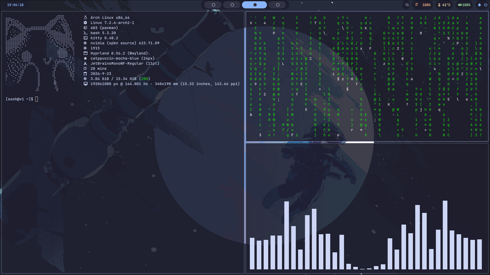
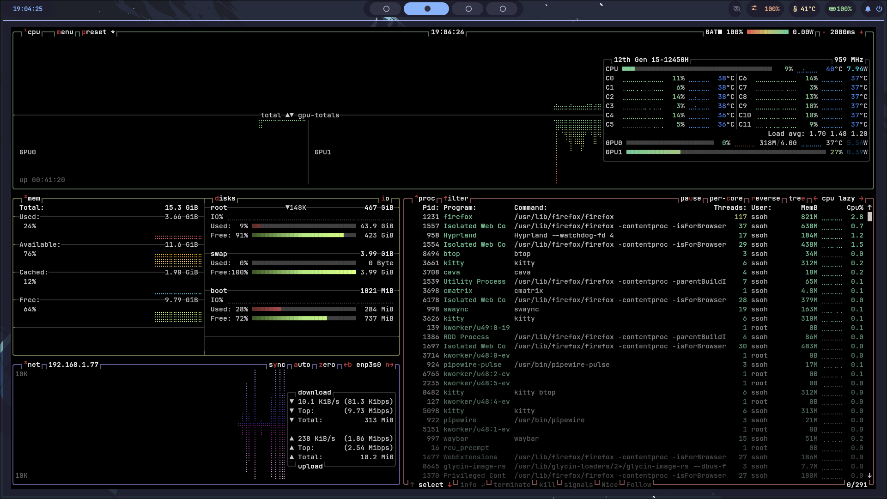

# ZeroDrag by Ka1

Минималистичное окружение на базе Hyprland для Arch Linux, оптимизированное для игр.

## Компоненты
*   **Arch Linux** — дистрибутив
*   **Hyprland** — оконный менеджер
*   **Waybar** — панель
*   **Rofi** — лаунчер
*   **Kitty** — терминал
*   **SwayNC** — уведомления
*   **SDDM** — экран входа (тема ii-sddm-theme)
*   **PipeWire** — звук
*   **Fastfetch** — информация о системе

## 📸 Скриншоты

### Рабочий стол


### Терминал с Cava


### Мониторинг системы (btop)


## Установка

```bash
git clone https://github.com/ssOh-v1/ZeroDrag-for-arch.git
cd ZeroDrag-for-arch
./install.sh

---

## ⌨️ Бинды

Полный список биндов смотри в [docs/KEYBINDS.md](docs/KEYBINDS.md).
